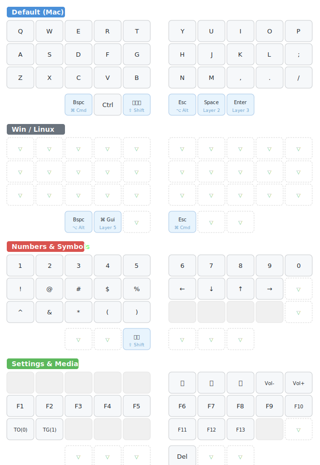

# KobitoKey RMK

RMK (Rust Mechanical Keyboard) firmware for KobitoKey — a 40-key wireless split keyboard with dual trackballs.

## Specs

- **MCU**: Seeeduino XIAO BLE (nRF52840)
- **Layout**: BLE wireless split (left = central, right = peripheral)
- **Keys**: 20 per side (17 main + 3 thumb), 40 total
- **Matrix**: 4 rows × 5 cols per side, col2row
- **Trackball**: PMW3610 on both halves (SPI half-duplex)
- **Features**: Vial support, 7 layers

## Keymap



**Legend**:
- Blue keys = hold-tap (tap action on top, hold action on bottom)
- Dashed border = transparent (inherits from lower layer)
- Gray keys = disabled (no action)

### Layers

| # | Name | Activation |
|---|------|-----------|
| 0 | Default (Mac) | Base layer |
| 1 | Win/Linux | TG(1) toggle |
| 2 | Numbers & Symbols | Hold Space |
| 3 | Settings & Media | Hold Enter |
| 4 | Mouse | Manual |
| 5 | Emacs | Hold LGui (Layer 1) |
| 6 | Neovim | Combo toggle |

## Build

```sh
# Enter dev environment
nix develop
# or with direnv: cd into the project

# Build
cargo build --release --bin central
cargo build --release --bin peripheral

# Generate UF2 files
cargo make uf2
```

## Flash

1. Double-tap the reset button on XIAO BLE to enter bootloader mode
2. A USB drive will appear
3. Drag `rmk-central.uf2` onto the left half
4. Repeat with `rmk-peripheral.uf2` for the right half
