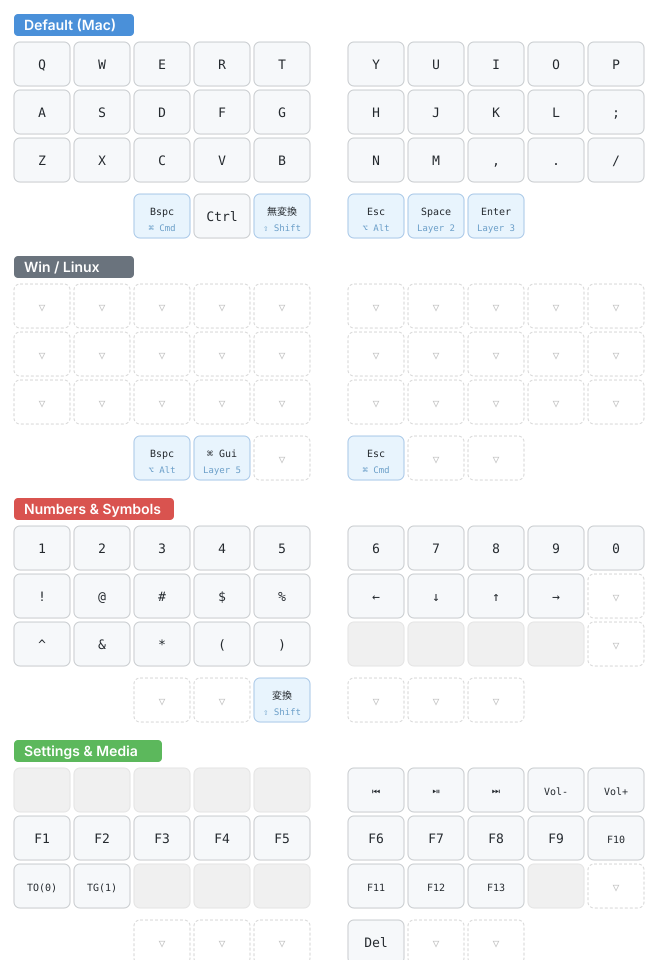

# KobitoKey RMK

KobitoKey 用の [RMK](https://github.com/HaoboGu/rmk) (Rust Mechanical Keyboard) ファームウェア。
40 キー BLE 分割キーボード + デュアル PMW3610 トラックボール。

ZMK 版 [KobitoKey_QWERTY](../KobitoKey_QWERTY) からの移植。

このリポジトリには 2 つのコンポーネントが含まれます:

- **firmware** (ルート + `reset/`) — central / peripheral / reset firmware (Rust + RMK 0.8.2)
- **web** ([`web/`](./web/)) — WebHID 経由の Web キーマップエディタ (React + Vite + TS)

[kobu](../kobu) firmware の機能 (status LED / 左右独立バッテリー / scroll-pointer 分離 /
runtime tunable CPI 等) を移植済み。

## スペック

| 項目 | 内容 |
|------|------|
| MCU | Seeeduino XIAO BLE (nRF52840) |
| 接続 | BLE 分割 (central = 左、peripheral = 右) + USB |
| キー数 | 40 (4 行 x 5 列 x 2) |
| ダイオード | col2row (RMK デフォルト) |
| ポインタ | PMW3610 x 2 (bit-bang SPI 半二重) |
| 永続化 | Vial keymap + BLE bond (`[storage]`) |

## ビルド環境

`flake.nix` + `direnv` で全ツールを管理しています。

```sh
# nix + direnv が入っていれば、ディレクトリに入るだけで自動的に環境が整う
direnv allow

# または手動で nix シェルに入る
nix develop
```

含まれるもの:
- Rust stable + `thumbv7em-none-eabihf` ターゲット
- `cargo-make`, `cargo-binutils` (objcopy), `flip-link`, `probe-rs`
- ※ `cargo-hex-to-uf2` は `cargo install` で取得 (`cargo make uf2` 実行時に自動)

## ビルド & UF2 生成

```sh
# 主ファームウェア (central + peripheral)
cargo make uf2

# リセットファームウェア (RMK storage 領域消去用)
cargo make uf2-reset

# 全部
cargo make uf2-all
```

生成物:
- `rmk-central.uf2` — 左半身 (central)
- `rmk-peripheral.uf2` — 右半身 (peripheral)
- `rmk-reset.uf2` — リセット用 (左右どちらでも可)

## フラッシュ手順

1. XIAO BLE のリセットボタンを **素早く 2 回** タップしてブートローダ起動
2. `XIAO-SENSE` ドライブが現れる
3. 該当する `.uf2` をドラッグ & ドロップ
   - 左半身 → `rmk-central.uf2`
   - 右半身 → `rmk-peripheral.uf2`
4. 自動再起動

### ペアリングをやり直したい場合

```sh
cargo make uf2-reset
```
で生成された `rmk-reset.uf2` を XIAO BLE にフラッシュすると、
storage 領域 (0x60000-0x70000, 64KB) が消去され、自動再起動。
その後通常のファームウェアを書き込み直してください。

## キーマップ



### レイヤー構成

| # | 名前 | 有効化 |
|---|------|--------|
| 0 | Mac QWERTY | ベース |
| 1 | Win/Linux overlay | `TG(1)` (Layer 3 から) |
| 2 | Numbers & Symbols | Space ホールド |
| 3 | Settings & Media | Enter ホールド |
| 4 | Mac shortcut / Mouse | (要手動切替) |
| 5 | Emacs (Win 用 Ctrl コンビ) | LGui ホールド (Layer 1 時) |
| 6 | Neovim (Ctrl 抑制) | S+D コンボトグル |

### コンボ

| キー | 出力 | Shift |
|------|------|-------|
| Q+W | `` ` `` | `~` |
| A+S | Tab | |
| Y+U | Backspace | |
| U+I | `\|` | `\` (fork) |
| I+O | `-` | `_` |
| O+P | `=` | `+` |
| J+K | `[` | `{` |
| K+L | `]` | `}` |
| L+; | `'` | `"` |
| N+M | Backspace | |
| `,`+`.` | `/` | `?` |
| D+F | Cmd+Alt (Mac) / Ctrl+Alt (Win) | |
| S+D | Layer 6 トグル | |

### Fork (mod-morph)

Shift 押下で出力反転 + Shift 自動抑制。

| キー | 通常 | Shift |
|------|------|-------|
| `;` | `:` | `;` |
| `\` (= U+I コンボ) | `\|` | `\` |

`;` キーは fork で morse 同士を差し替えることで hold-tap と mod-morph を両立 (詳細は下記)。

### ホールドタップ

| 位置 | Tap | Hold | レイヤー |
|------|-----|------|----------|
| 左親指 1 | Backspace | Cmd (Mac) / Alt (Win) | 0 / 1 |
| 左親指 2 | LCtrl | (Layer 5 LT) | 1 |
| 左親指 3 | Lang2 (かな) | LShift | 0 |
| 左親指 3 | Lang1 (英数) | LShift | 2 |
| 右親指 1 | Escape | LAlt (Mac) / LGui (Win) | 0 / 1 |
| 右親指 2 | Space | Layer 2 | 0 |
| 右親指 3 | Enter | Layer 3 | 0 |
| 右小指 `;` | `:` (Shift で `;` 反転) | Cmd+Shift (Mac) / Ctrl+Shift (Win) | 0 / 1 |
| 右小指 `/` | `/` (Shift で `?`) | Cmd+Ctrl (Mac) / Ctrl+Alt (Win) | 0 / 1 |
| L4 左人差し指 `[` | Cmd+`[` | LShift | 4 |
| L5 左小指 Home | Home (double-tap で Ctrl+A) | — | 5 |
| L5 右人差し指 K | Ctrl+K (double-tap で kill-line マクロ) | — | 5 |

## ZMK→RMK 移植時の差分

| 機能 | 状態 | 備考 |
|------|------|------|
| 4 行 x 10 列 BLE split | ✅ | |
| PMW3610 x 2 (bit-bang) | ✅ | |
| 7 レイヤー | ✅ | |
| コンボ (14 個) | ✅ | ZMK と同じ position・出力 |
| mod-morph 反転 (`\|` ↔ `\`) | ✅ | U+I コンボに fork を適用 |
| mod-morph 反転 (`:` ↔ `;`) | ✅ | TD(0)→TD(1) (Mac) / TD(2)→TD(3) (Win) を fork で切替 |
| ホールドタップ (`;` キー, Cmd/Ctrl+Shift) | ✅ | morse (TD) で実現 |
| ホールドタップ (`/` キー, Cmd+Ctrl) | ✅ | `MT(Slash, ...)` (`/`/`?` は shift で自然反転) |
| ホールドタップ (親指キー全般) | ✅ | `MT(...)` |
| Layer 4 mt LSHFT LG(LBKT) | ✅ | `TD(4)` morse |
| tap-dance (td_home_ctla) | ✅ | `TD(5)` morse (tap=Home, double=Ctrl+A) |
| tap-dance (td_kill_line) | ✅ | `TD(6)` morse + macro0 |
| マクロ (kill_line) | ✅ | `macro0` = Shift+End → Delete |
| 全角/半角キー (LANG1/2) | ✅ | `Language1`/`Language2` (HID 0x90/0x91) |
| BLE プロファイル切替 (BT_SEL 0..4) | ✅ | `User(0)`〜`User(4)` (ble_profiles_num=5) |
| BLE bond クリア (BT_CLR) | ✅ | `User(7)` (ClearProfile) |
| Vial | ✅ | |
| auto-mouse layer | ❌ | RMK 未対応 (Layer 4 は手動切替) |
| センサー回転角度 (任意角度) | ❌ | RMK は invert/swap のみ |
| RGB LED widget | ✅ | `src/status_led.rs` で XIAO BLE onboard RGB (P0_26/30/06) を制御。<br>battery 色 (緑/黄/赤) + 右トラックボール操作時の紫オーバーレイ + VBUS 検知 |
| BLE Battery Service (macOS) | ✅ | BAS 1.1 (UUID 0x2BED) + 充電中アイコン対応。`build.rs` のパッチで rmk 0.8.2 を BAS v3 仕様に拡張 |
| 左右独立バッテリー読み取り | ✅ | `src/battery_source.rs` で central/peripheral を別の atomic に分離。<br>Web UI から Custom Value channel 0xC0 で取得可能 |
| Scroll / Pointer 分離 | ✅ | `src/trackball.rs`: 左 = ScrollProcessor (H/V → wheel), 右 = PointerProcessor (X/Y → mouse) |
| runtime tunable settings | ✅ | `src/config.rs` で CPI / scroll / LED 閾値を atomic 化。Vial CustomGetValue ハンドラ実装済み |
| macOS BLE 強化 | ✅ | LE 1M PHY + BLE-priority default + SAADC 40µs + DCDC reg0/reg1 + tx_power=+8dBm |

### `;` キーの完全再現方法

ZMK の `ht_cmd_shift_colon` は「hold=Cmd+Shift」+「tap=mod-morph(`:`/`;` 反転)」の組合せ。
RMK の fork は morse の tap 出力に直接は適用できないので、**fork で morse 自体を差し替える**ことで等価動作を実現:

```
Position L0 (1,9) = TD(0)
Position L1 (1,9) = TD(2)

morse[0]: tap = WM(Semicolon, LShift) = `:`     hold = Cmd+Shift   (Shift なし時)
morse[1]: tap = Semicolon                hold = Cmd+Shift   (Shift 抑制で `;` を出す)
morse[2]: tap = WM(Semicolon, LShift) = `:`     hold = Ctrl+Shift  (Win)
morse[3]: tap = Semicolon                hold = Ctrl+Shift  (Win Shift)

fork: TD(0) --(LShift|RShift)--> TD(1)    Shift 抑制
fork: TD(2) --(LShift|RShift)--> TD(3)    Shift 抑制
```

## バリアントビルド (CI)

`.github/workflows/build.yml` で `shiro` / `yoru` / `yo` の 3 バリアントを
それぞれ別の BLE デバイス名でビルドします。

`workflow_dispatch` でも手動実行可能。

## Web エディタ

`web/` 配下に React + Vite ベースの Web キーマップエディタが入っています。

```sh
cd web
direnv allow      # または: nix develop "path:..#web"
pnpm install
pnpm dev
```

Chrome / Edge / Brave などの Chromium 系ブラウザで `http://localhost:5173` を開き、
USB-C で接続したセントラル (左半身) を選択するとキーマップ・コンボ・マクロ・
Morse・トラックボール CPI・スクロール感度・ステータス LED 閾値・左右バッテリー残量
が閲覧/編集できます。詳細は [`web/README.md`](./web/README.md)。

## ライセンス

- firmware: MIT
- web: GPLv2 (ベースの `kobu/web` のライセンスを継承)
